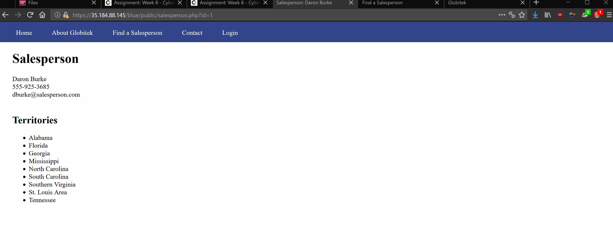

# Project 8 - Pentesting Live Targets

Time spent: 3.5 hours spent in total

> Objective: Identify vulnerabilities in three different versions of the Globitek website: blue, green, and red.

The six possible exploits are:
* Username Enumeration
* Insecure Direct Object Reference (IDOR)
* SQL Injection (SQLi)
* Cross-Site Scripting (XSS)
* Cross-Site Request Forgery (CSRF)
* Session Hijacking/Fixation

Each version of the site has been given two of the six vulnerabilities. (In other words, all six of the exploits should be assignable to one of the sites.)

## Blue

Vulnerability #1: SQLI

The php query for the salesman ID's is vulnerable to SQLI.  In this example, it sleeps when the sleep command is passed.

Vulnerability #2: Session Hijacking

The admin's cookie is seen through the dev tools.  This can be copied and pasted into a new browser session with the provided change_session.php.  Once changed, the person in the new session is now the admin.

## Green

Vulnerability #1: XSS

The feedback box does not sanitize script input.  The script is then executed when an admin checks the feedback.  This could be used to steal admin cookies.

Vulnerability #2: User Enum

When trying to log in, visual feedback is given if a user exists.  Bold if exists, not bold otherwise.

## Red

Vulnerability #1: IDOR (Insecure direct object ref)

Manually changing the number in the php query gives results that are not public.

Vulnerability #2: CSRF

Able to send a request from burp to manipulate information on the site.

## Notes

Finding the exploits.

